## Test Plan 1: `/all-student`

Endpoint `/all-student` diuji menggunakan JMeter untuk melihat performa aplikasi ketika mengambil seluruh data student.


## Test Plan 2: `/all-student-name`

Endpoint `/all-student-name` diuji menggunakan JMeter untuk melihat performa aplikasi ketika hanya mengambil nama student.


## Test Plan 3: `/highest-gpa`

Endpoint `/highest-gpa` diuji menggunakan JMeter untuk melihat performa aplikasi ketika mengambil satu student dengan GPA tertinggi.

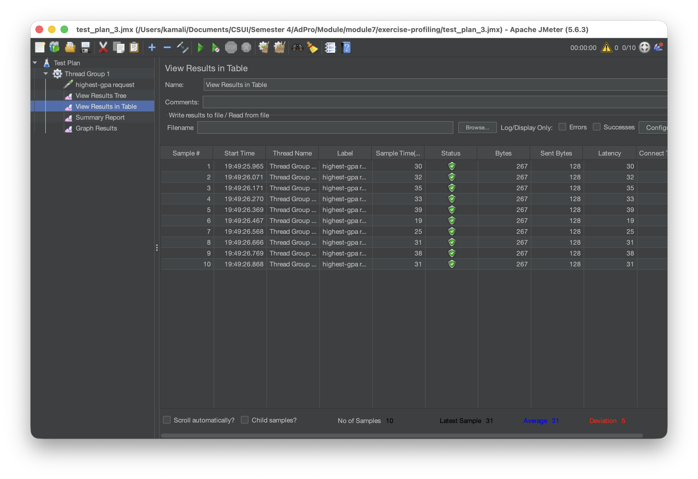

## Kesimpulan Singkat

Berdasarkan pengujian dengan JMeter, setiap endpoint dapat dibandingkan dari sisi waktu respons dan latency. Endpoint yang mengambil data lebih banyak, seperti `/all-student`, umumnya membutuhkan waktu lebih lama dibanding endpoint yang hanya mengambil sebagian data atau satu data tertentu, seperti `/all-student-name` dan `/highest-gpa`.

## Pengujian Melalui Command Line

Selain menggunakan GUI, test plan juga dijalankan melalui command line menggunakan mode non-GUI. Mode ini lebih ringan dan cocok digunakan untuk menyimpan hasil pengujian secara otomatis dalam file `.jtl`.

Command yang digunakan:

```bash
jmeter -n -t test_plan_1.jmx -l results1.jtl
jmeter -n -t test_plan_2.jmx -l results2.jtl
jmeter -n -t test_plan_3.jmx -l results3.jtl
```

## Hasil Pengujian 1: Endpoint `/all-student`

Pengujian pertama dilakukan pada endpoint `/all-student`. Endpoint ini digunakan untuk mengambil seluruh data student yang tersedia di database. Karena data yang dikembalikan cukup besar, endpoint ini berpotensi memiliki waktu respons yang lebih tinggi dibanding endpoint lain.

Hasil pengujian menunjukkan bahwa request berhasil dijalankan oleh JMeter dan hasilnya tersimpan pada file `results1.jtl`.

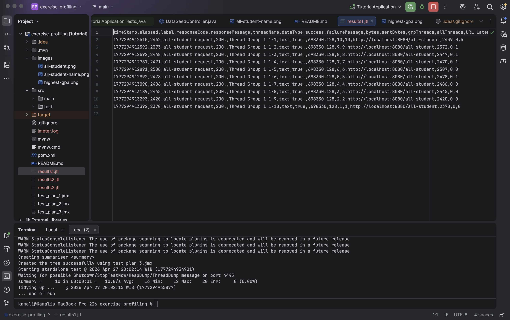

## Hasil Pengujian 2: Endpoint `/all-student-name`

Pengujian kedua dilakukan pada endpoint `/all-student-name`. Endpoint ini digunakan untuk mengambil daftar nama student saja, sehingga data yang dikembalikan lebih ringan dibandingkan `/all-student`.

Hasil pengujian menunjukkan bahwa request berhasil dijalankan melalui JMeter. Output hasil pengujian disimpan pada file `results2.jtl`, yang berisi informasi seperti elapsed time, response code, status success, jumlah bytes, latency, dan thread name.

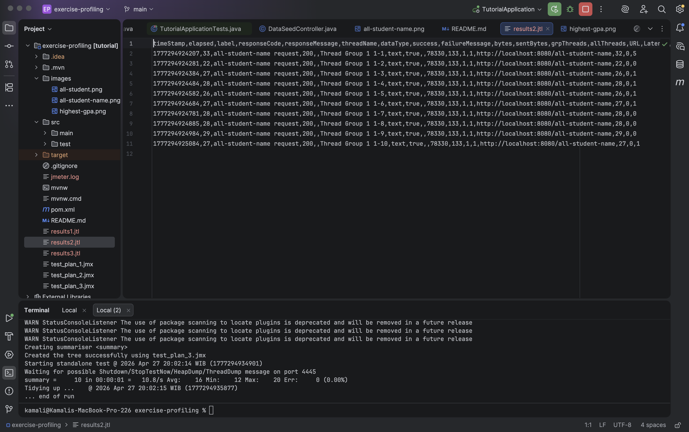

## Hasil Pengujian 3: Endpoint `/highest-gpa`

Pengujian ketiga dilakukan pada endpoint `/highest-gpa`. Endpoint ini digunakan untuk mengambil data student dengan GPA tertinggi. Berdasarkan hasil command line JMeter, seluruh request berhasil dijalankan dengan response code `200` dan error rate `0.00%`.

Pada screenshot `results3`, terlihat bahwa file `results3.jtl` berisi hasil request untuk endpoint `/highest-gpa`. Setiap baris menunjukkan hasil satu request, termasuk waktu eksekusi, label request, response code, status success, dan URL endpoint yang diuji.

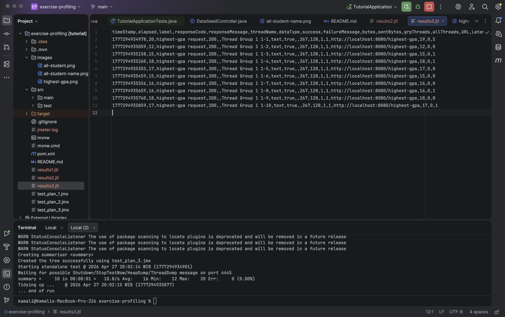

## Profiling CPU Time dan Optimasi Kode

Pada tahap ini, dilakukan profiling untuk mengetahui bagian kode yang menggunakan CPU time paling besar. Profiling dilakukan sebelum dan sesudah proses optimasi agar perubahan performa dapat dibandingkan dengan jelas.

Optimasi dilakukan pada tiga endpoint utama:

1. `/all-student`
2. `/all-student-name`
3. `/highest-gpa`

Tujuan dari optimasi ini adalah mengurangi proses yang tidak efisien di sisi aplikasi, terutama proses yang mengambil terlalu banyak data dari database atau melakukan iterasi manual pada data yang sebenarnya dapat diproses langsung melalui query repository.

---

## 1. Endpoint `/all-student`

Endpoint `/all-student` digunakan untuk mengambil seluruh data student beserta course yang dimiliki. Sebelum optimasi, proses ini memiliki CPU time yang cukup tinggi karena aplikasi perlu memproses banyak data student dan relasi course.

### Sebelum Optimasi

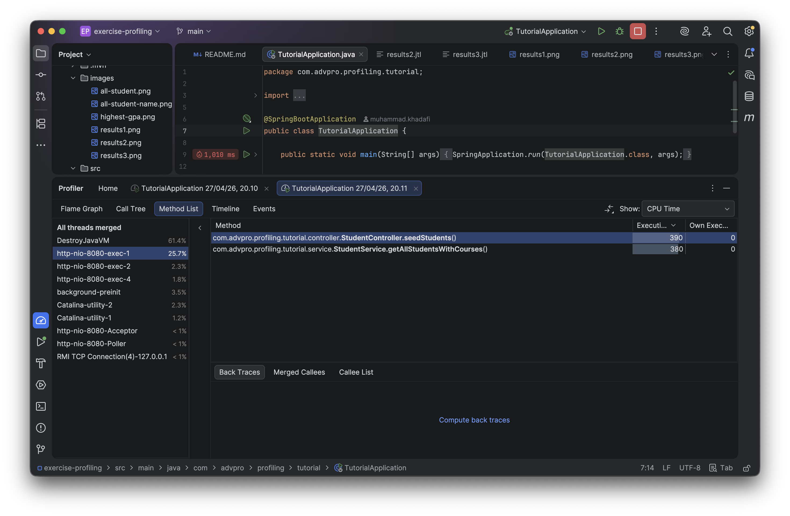

Pada hasil profiling sebelum optimasi, terlihat bahwa proses pengambilan seluruh student dengan course masih cukup berat. Hal ini terjadi karena jumlah data yang besar membuat aplikasi membutuhkan waktu pemrosesan lebih tinggi, terutama pada bagian query dan pembentukan data relasi.

### Sesudah Optimasi

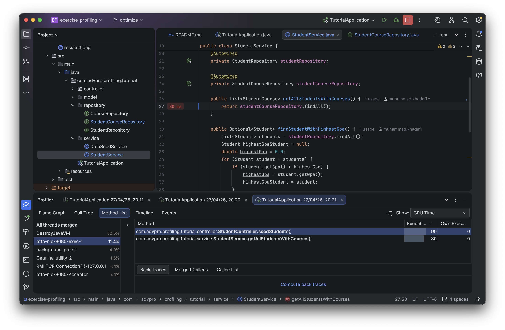

Setelah optimasi, CPU time pada endpoint ini mengalami penurunan. Optimasi dilakukan dengan memperbaiki cara pengambilan data agar lebih efisien dan mengurangi proses yang tidak diperlukan di sisi aplikasi. Dengan demikian, beban CPU menjadi lebih ringan dibandingkan sebelum optimasi.

---

## 2. Endpoint `/all-student-name`

Endpoint `/all-student-name` digunakan untuk mengambil seluruh nama student dalam bentuk gabungan string. Sebelum optimasi, aplikasi mengambil seluruh data student terlebih dahulu, kemudian melakukan proses penggabungan nama secara manual.

### Sebelum Optimasi

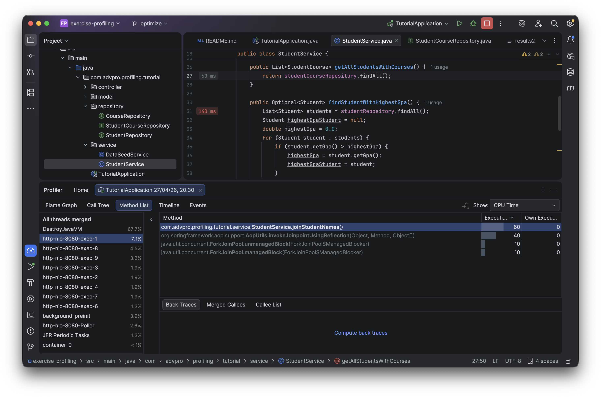

Pada hasil profiling sebelum optimasi, proses ini masih kurang efisien karena aplikasi mengambil seluruh object student, padahal data yang dibutuhkan hanya nama student. Selain itu, proses penggabungan string yang dilakukan berulang dapat menambah beban CPU ketika jumlah data besar.

### Sesudah Optimasi

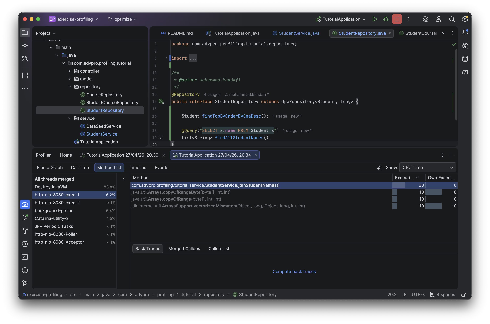

Setelah optimasi, proses dibuat lebih ringan dengan hanya mengambil data nama student yang dibutuhkan. Selain itu, penggabungan string dilakukan dengan cara yang lebih efisien. Hasil profiling menunjukkan bahwa CPU time setelah optimasi menjadi lebih rendah dibandingkan sebelumnya.

---

## 3. Endpoint `/highest-gpa`

Endpoint `/highest-gpa` digunakan untuk mengambil student dengan GPA tertinggi. Sebelum optimasi, aplikasi mengambil seluruh data student terlebih dahulu, lalu mencari student dengan GPA tertinggi melalui proses iterasi di sisi aplikasi.

### Sebelum Optimasi

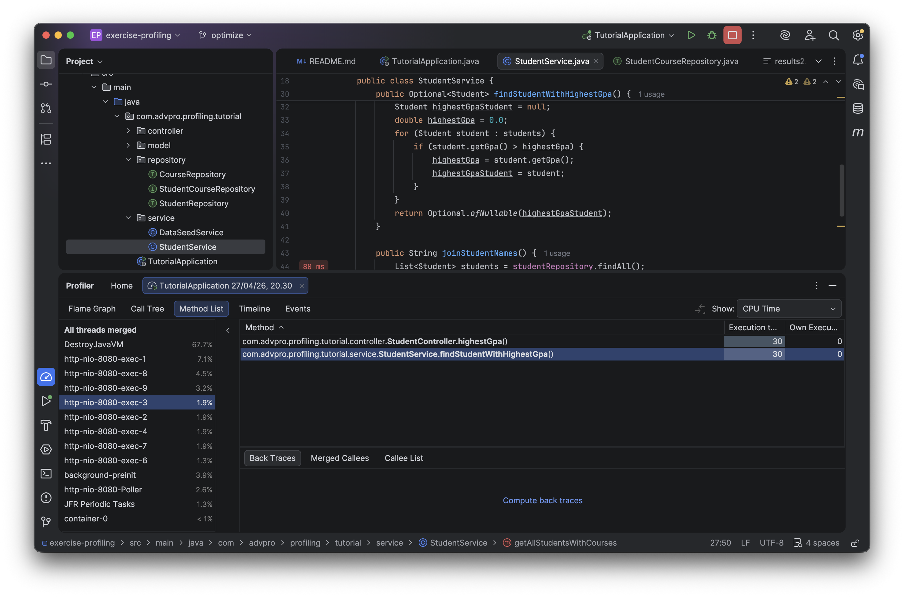

Pada hasil profiling sebelum optimasi, pendekatan ini kurang efisien karena aplikasi perlu membaca dan memproses seluruh data student. Padahal, pencarian student dengan GPA tertinggi dapat dilakukan langsung melalui query database.

### Sesudah Optimasi

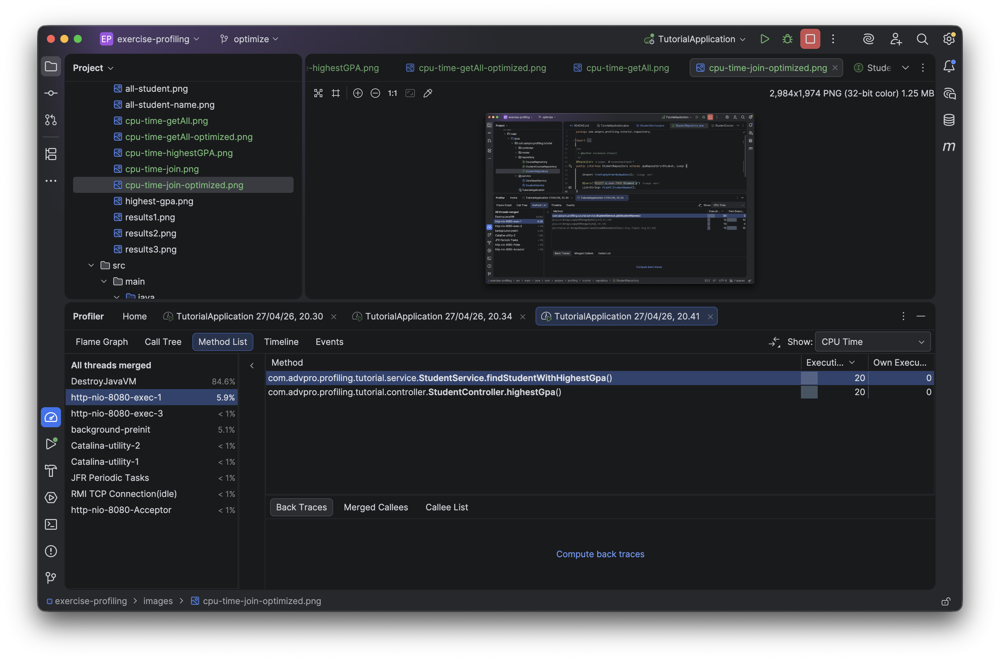

Setelah optimasi, pencarian student dengan GPA tertinggi dilakukan melalui repository query. Dengan cara ini, database langsung mengembalikan student dengan GPA tertinggi tanpa aplikasi harus memproses seluruh data student satu per satu. Hasil profiling menunjukkan adanya penurunan CPU time pada endpoint ini.

---

## Kesimpulan Profiling CPU Time

Berdasarkan hasil profiling sebelum dan sesudah optimasi, dapat disimpulkan bahwa proses refactoring berhasil mengurangi penggunaan CPU time pada endpoint yang diuji. Optimasi paling penting dilakukan dengan mengurangi pemrosesan data yang tidak perlu di sisi aplikasi dan memindahkan proses pencarian atau pengambilan data spesifik ke repository query.

Secara umum, optimasi memberikan dampak positif karena:

1. aplikasi tidak lagi mengambil data yang tidak dibutuhkan,
2. proses iterasi manual dapat dikurangi,
3. query database menjadi lebih spesifik,
4. penggunaan CPU time menjadi lebih rendah,
5. endpoint menjadi lebih efisien untuk menangani request.

Dengan demikian, proses optimasi berhasil meningkatkan efisiensi aplikasi berdasarkan hasil profiling CPU time.

---

## Pengujian Performa Menggunakan JMeter Setelah Optimasi

Setelah proses profiling dan optimasi kode selesai dilakukan, pengujian performa kembali dilakukan menggunakan Apache JMeter. Tujuannya adalah untuk membandingkan hasil pengukuran sebelum dan sesudah optimasi, terutama dari sisi waktu respons endpoint.

Pengujian dilakukan pada tiga endpoint:

1. `/all-student`
2. `/all-student-name`
3. `/highest-gpa`

---

## 1. Endpoint `/all-student`

### Sebelum Optimasi


### Sesudah Optimasi


Berdasarkan hasil JMeter, endpoint `/all-student` menunjukkan peningkatan performa setelah optimasi. Waktu respons setelah optimasi menjadi jauh lebih kecil dibandingkan hasil pengukuran awal. Hal ini menunjukkan bahwa proses pengambilan data student dan course menjadi lebih efisien setelah refactoring dilakukan.

---

## 2. Endpoint `/all-student-name`

### Sebelum Optimasi


### Sesudah Optimasi


Pada endpoint `/all-student-name`, hasil setelah optimasi juga menunjukkan penurunan waktu respons yang signifikan. Sebelum optimasi, aplikasi masih mengambil data student secara lebih besar dari yang dibutuhkan. Setelah optimasi, aplikasi hanya memproses data nama student yang diperlukan, sehingga hasil JMeter menunjukkan angka yang jauh lebih kecil.

---

## 3. Endpoint `/highest-gpa`

### Sebelum Optimasi


### Sesudah Optimasi

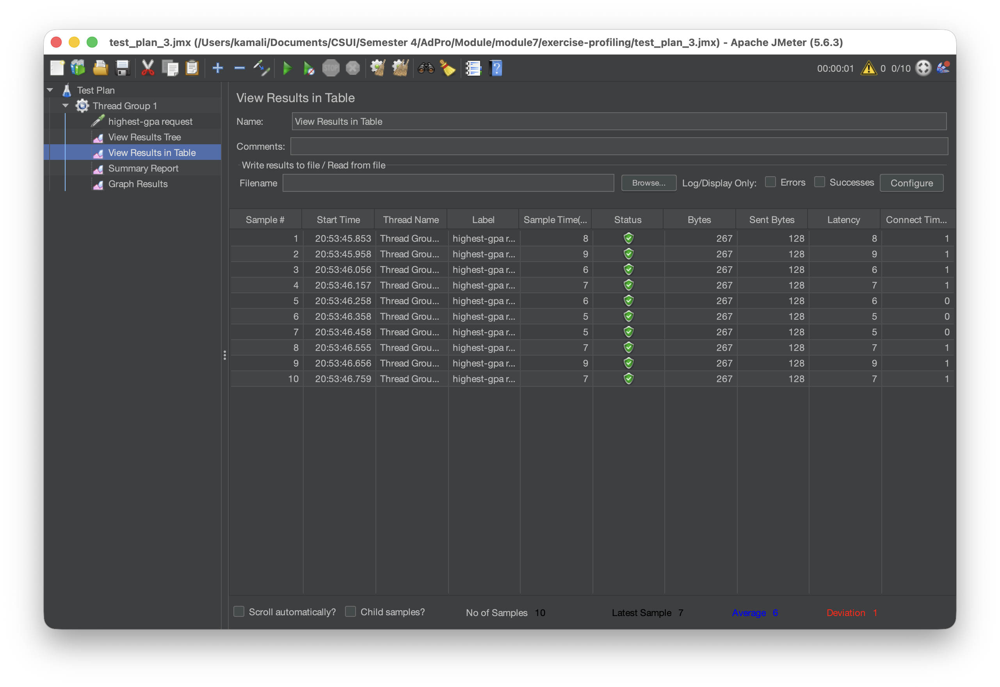

Endpoint `/highest-gpa` juga mengalami peningkatan performa setelah optimasi. Sebelum optimasi, pencarian student dengan GPA tertinggi dilakukan dengan mengambil seluruh data student terlebih dahulu. Setelah optimasi, pencarian dilakukan langsung melalui query repository, sehingga waktu respons menjadi jauh lebih kecil pada hasil pengujian JMeter.

---

## Kesimpulan Pengujian JMeter

Berdasarkan hasil pengujian ulang menggunakan JMeter, terdapat peningkatan performa yang jelas setelah proses optimasi dilakukan. Pada ketiga endpoint yang diuji, angka waktu respons setelah optimasi menjadi jauh lebih kecil dibandingkan pengukuran sebelum optimasi.

Secara umum, optimasi berhasil meningkatkan performa karena:

1. data yang diambil dari database menjadi lebih spesifik,
2. proses iterasi manual di sisi aplikasi berkurang,
3. query repository menjadi lebih efisien,
4. waktu respons endpoint menjadi lebih cepat,
5. hasil JMeter menunjukkan penurunan sample time setelah optimasi.

Dengan demikian, dapat disimpulkan bahwa proses refactoring dan optimasi berhasil memberikan peningkatan performa pada endpoint `/all-student`, `/all-student-name`, dan `/highest-gpa`.